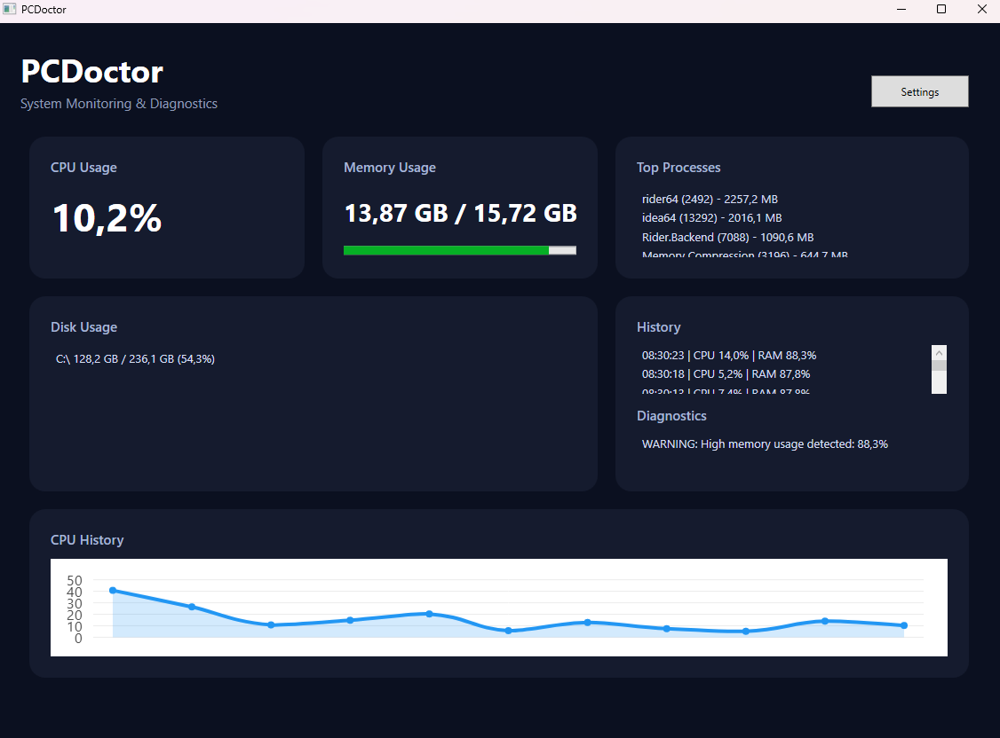
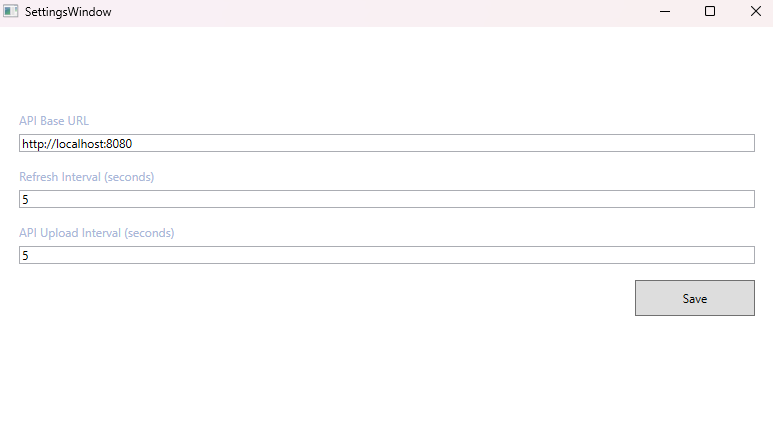

# PCDoctor – System Monitoring & Diagnostics Platform

PCDoctor is a full-stack system monitoring application built with **C#**, **WPF**, **Java Spring Boot**, **REST APIs**, **PostgreSQL**, and **Docker**.

The application continuously monitors system resources such as CPU usage, memory usage, disk usage, and running processes in real time. The collected metrics are displayed in a modern WPF dashboard and periodically sent to a Spring Boot backend for persistence, historical analysis, and diagnostics.

---

## Features

- Real-time CPU monitoring
- Real-time memory monitoring
- Disk usage overview
- Top running processes by memory consumption
- Live CPU history chart (LiveCharts2)
- Modern WPF dashboard (MVVM architecture)
- Configurable refresh and API synchronization intervals
- Java Spring Boot REST API
- PostgreSQL persistence
- Historical system statistics
- Basic diagnostic warnings for high CPU and memory usage
- Docker support for backend and database
- Structured logging with Serilog

---

## Architecture

PCDoctor consists of three main components:

```
PCDoctor.UI
│
├── WPF Desktop Application
├── MVVM Architecture
├── LiveCharts2 Dashboard
└── REST Client

        │
        ▼

PCDoctor.Core
│
├── System Monitoring
├── API Communication
├── Business Logic
└── Monitoring Services

        │
        ▼

Spring Boot REST API
│
├── REST Controllers
├── Service Layer
├── Spring Data JPA
└── PostgreSQL Database
```

### Data Flow

```
System Resources
        │
        ▼
PCDoctor.Core
        │
        ▼
WPF Dashboard
        │
        ▼
REST API
        │
        ▼
Spring Boot
        │
        ▼
PostgreSQL
```

---

## Technologies

### Frontend

- C#
- .NET
- WPF
- MVVM
- LiveCharts2

### Backend

- Java 17
- Spring Boot
- Spring Data JPA
- REST API

### Database

- PostgreSQL

### DevOps

- Docker
- Docker Compose
- Git

### Logging

- Serilog

---

## REST API

### Store system statistics

```
POST /api/system-stats
```

### Get latest statistics

```
GET /api/system-stats/latest
```

### Get history

```
GET /api/system-stats/history
```

### Get diagnostics

```
GET /api/system-stats/diagnostics
```

---

## Database

The backend stores system statistics including:

- CPU usage
- Used memory
- Total memory
- Timestamp

---

## Project Structure

```
PCDoctor
│
├── PCDoctor.UI          # WPF Desktop Application
├── PCDoctor.Core        # Monitoring & Business Logic
├── pcdoctor-api         # Spring Boot REST API
├── docker-compose.yml
└── README.md
```

---

## Getting Started

### Prerequisites

- .NET SDK
- Java 17+
- Docker Desktop

### Clone the repository

```bash
git clone https://github.com/<your-username>/PCDoctor.git
cd PCDoctor
```

### Configure environment variables

Create a `.env` file in the project root:

```env
DB_PASSWORD=your_password
```

### Start PostgreSQL and Backend

```bash
docker compose up -d --build
```

### Run the WPF application

Open the solution in Rider or Visual Studio and start **PCDoctor.UI**.

---

## Screenshots

### Dashboard

> 

### Settings

> 

### CPU History

> 

### PostgreSQL Database

> 

---

## Current Project Status

🚧 **Work in Progress**

Current focus areas include:

- Improving diagnostics
- Additional performance metrics
- UI enhancements
- Unit testing
- CI/CD pipeline
- Application installer

---

## Learning Goals

This project serves as a portfolio application demonstrating:

- Desktop application development with WPF
- MVVM architecture
- Clean software architecture
- REST API development
- Java Spring Boot
- PostgreSQL integration
- Docker containerization
- Logging and diagnostics
- Full-stack application development